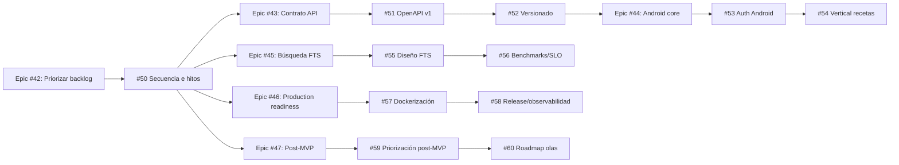

# Roadmap: Epic #48 execution sequence

Tracks the full dependency tree of epic #48 (`Ejecución integral del DEVELOPMENT_PLAN`). Child epics and their leaf tasks:

After #50 lands, three tracks (#45→#46, #46→#47... — see below) have no dependency on #43/#44 or each other and can proceed in parallel with the Android work. A single linear execution order is given below for traceability.

## Milestones

### M0 — #50: Secuencia e hitos (this doc)
- **Entry:** epic #48 tree fully enumerated (done — 11 open leaf tasks across 6 child epics).
- **Exit:** this roadmap exists, covering all 10 remaining tasks with entry/exit criteria and blocking edges.
- **Blocks:** nothing downstream technically depends on this doc's *content*, but it is the agreed sequencing reference for the rest of the epic.

### M1 — #51: Especificación OpenAPI v1
- **Entry:** M0 complete.
- **Exit (from issue):** existe spec OpenAPI v1 para endpoints core; incluye esquemas y errores normalizados; queda versionada en el repositorio.
- **Artifact:** `backend/api/openapi.yaml`.
- **Blocked by:** none technically (derivable from current route table), sequenced after M0 by convention.

### M2 — #52: Política de versionado y compatibilidad API
- **Entry:** M1 complete (references the OpenAPI doc as "the contract" being versioned).
- **Exit:** política documentada de versionado; proceso de deprecaciones definido; checklist de breaking changes.
- **Artifact:** `docs/api/VERSIONING.md`, `docs/api/CHANGELOG.md`.
- **Blocked by:** #51.

### M3 — #53: Autenticación Android contra backend
- **Entry:** M2 complete (API contract stable enough to bind against); `mobile/` currently does not compile — this task's Phase A fixes that first.
- **Exit:** login funciona contra endpoints reales; refresh token mantiene sesión; logout limpia estado local.
- **Blocked by:** #52 (by convention/sequencing — technically only needs the real, already-existing auth endpoints, not the versioning doc itself).

### M4 — #54: Vertical Android de recetas (lista/detalle/crear)
- **Entry:** M3 complete — app compiles and has a working session/auth layer.
- **Exit:** se listan recetas desde API; se muestra detalle; se crea receta básica; errores de red gestionados de forma visible.
- **Blocked by:** #53 (hard dependency — needs compiling app + auth interceptor for authenticated create).

### M5 — #55: Diseño FTS/índices y plan de migración
- **Entry:** M0 complete. Independent of M1–M4.
- **Exit:** diseño técnico aprobado de FTS/índices; ruta de migración por etapas; riesgos y fallback documentados.
- **Artifact:** `docs/search/FTS_DESIGN.md`.
- **Blocked by:** #50 only.

### M6 — #56: Benchmarks y SLO de latencia de búsqueda
- **Entry:** M5 complete (benchmarks should measure against the documented target scenarios).
- **Exit:** escenarios reproducibles de benchmark; SLO/umbrales fijados; baseline actual reportado.
- **Blocked by:** #55.

### M7 — #57: Dockerización y estrategia de ejecución
- **Entry:** M0 complete. Independent of M1–M6.
- **Exit:** diseño de Dockerización para backend; configuración por entorno definida; ejecución reproducible documentada.
- **Artifact:** `backend/Dockerfile`, `docker-compose.yml`, `docs/ops/DOCKER.md`.
- **Blocked by:** #50 only.

### M8 — #58: Pipeline de release y observabilidad mínima
- **Entry:** M7 complete (release pipeline builds the image #57 defines).
- **Exit:** pipeline de release definido; señales mínimas de observabilidad establecidas; guía operativa de incidentes básicos.
- **Blocked by:** #57 (hard — the release workflow builds/pushes the Dockerfile from #57).

### M9 — #59: Priorizar iniciativas post-MVP
- **Entry:** M0 complete. Independent of all other tracks.
- **Exit:** ranking priorizado de iniciativas; justificación de prioridad por iniciativa; dependencias clave identificadas.
- **Artifact:** `docs/postmvp/PRIORITIZATION.md`.
- **Blocked by:** #50 only.

### M10 — #60: Desglosar roadmap incremental de extensiones
- **Entry:** M9 complete.
- **Exit:** roadmap por olas con alcance concreto; criterio de finalización por ola; dependencias cruzadas minimizadas entre olas.
- **Artifact:** `docs/postmvp/ROADMAP.md`.
- **Blocked by:** #59 (hard — waves are built from the ranked list).

## Known deviations from `DEVELOPMENT_PLAN.md` this epic exists to close

- **API contract:** plan describes OpenAPI 3.0 as shared infra (§6); reality is a flat, unversioned `/api` prefix with no spec file anywhere — closed by #51/#52.
- **Search:** plan describes FTS/indexing (§3); reality is LIKE-based search with zero indexes — closed by #55/#56.
- **Deployment:** plan describes Docker + CI/CD (§7 Phase 4-5); reality is a single test+build GitHub Actions workflow and no Docker artifacts at all — closed by #57/#58.
- **Android:** plan describes a full native MVVM/Compose/Room client (§6); reality is a non-compiling scaffold with mismatched domain models — closed by #53/#54.
