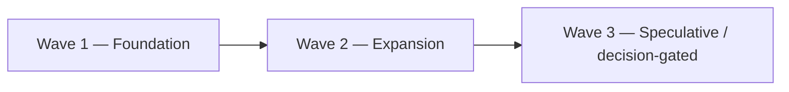

# Post-MVP Roadmap: Delivery Waves

Turns the ranking in [`PRIORITIZATION.md`](PRIORITIZATION.md) into three sequenced
waves. Items are grouped so that **cross-wave dependencies are minimized** — within a
wave, items are independent of each other and can be built in parallel; between waves,
each wave only depends on the previous wave's exit criteria, never on a specific other
item finishing first unless called out explicitly below.

## Wave 1 — Foundation

Items: **#1 FTS5 migration, #2 Android recipe edit/delete, #3 Android image upload**
(numbering matches `PRIORITIZATION.md`).

- **Entry:** epic #48 (#50–#58) complete — real search design + baseline benchmarks
  exist, the Android auth+recipes vertical exists and compiles (pending real
  Gradle/Android Studio verification — see the caveat in `docs/ROADMAP.md`'s Android
  tasks), Docker/release pipeline exists.
- **Scope, per item:**
  - FTS5: implement exactly what `docs/search/FTS_DESIGN.md` specifies — the
    `recipe_search` virtual table, sync triggers, the non-FTS indexes, and the backfill —
    then swap `buildRecipeSearchWhere`'s text-match clause. Re-run `make bench-search` and
    update `docs/search/BENCHMARKS.md` with the after numbers.
  - Android edit/delete: add `updateRecipe`/`deleteRecipe` to `RecipeApi` +
    `RecipeRepository`/`RecipeRepositoryImpl`, an edit screen reusing
    `RecipeCreateViewModel`'s shape, and a delete confirmation from the detail screen.
  - Android image upload: add the upload endpoint to `network`'s API interfaces
    (multipart), a camera/gallery picker (needs `READ_MEDIA_IMAGES`/camera permission
    handling not yet present anywhere in `mobile/`), and wire it into the create/edit
    screens from the two items above.
- **Exit:** FTS5 live in `schema.sql` with a documented before/after benchmark; Android
  users can edit and delete their own recipes; Android users can attach a photo when
  creating or editing a recipe.
- **Why these three together:** all P0, mutually independent (confirmed in
  `PRIORITIZATION.md`'s dependency section), and each is "finish what an existing task in
  this epic started" rather than new architecture — lowest-risk wave to run first.
- **Not in this wave on purpose:** pagination (#4) is deliberately excluded even though
  it's cheap — paginating a list that FTS5 hasn't sped up yet just surfaces the same
  quadratic cost sooner (see `PRIORITIZATION.md`'s dependency note).

## Wave 2 — Expansion

Items: **#4 pagination, #5 Collections on Android, #6 Ratings & reviews, #7 Metrics &
alerting**.

- **Entry:** Wave 1 exit criteria met — specifically, FTS5 must be live before starting
  #4 (hard dependency; everything else in this wave only needs Wave 1 to be *done*, not
  any specific item in it).
- **Scope, per item:**
  - Pagination: add infinite-scroll (or "load more") to `RecipeListScreen`, using the
    `limit`/`offset` params `RecipeApi.getRecipes` already accepts.
  - Collections on Android: new domain model + repository + DI bindings + list/detail
    screens, mirroring the recipes vertical's structure from #54. The API contract
    already exists (`openapi.yaml`'s `/collections` paths) — this is additive scaffolding
    work, not backend design.
  - Ratings & reviews: needs a short design pass first (schema for aggregate rating
    storage + one-rating-per-user-per-recipe constraint, API surface) before
    implementation — `models.Rating` is currently just a stub struct, not a design.
    Produce a short design note (can live in this same wave) before writing code, the
    same way #55 preceded #56 in the original epic.
  - Metrics & alerting: add a Prometheus-format `/metrics` endpoint, a dashboard, and
    wire up the p95 search-latency alert threshold `docs/search/BENCHMARKS.md` already
    proposes but doesn't enforce.
- **Exit:** Android recipe list scales past one page; Android has a working collections
  vertical; ratings have a real design and (if scope allows within the wave) a working
  implementation; search latency has a live dashboard and firing alert, not just a
  documented target.
- **Why these four together:** all P1, none blocks another item in this wave, and
  together they round out the Android app to parity with what the web UI + backend
  already support (collections, at minimum) while adding the operational visibility
  needed to safely support Wave 1's higher-scale search.

## Wave 3 — Speculative / decision-gated

Items: **#8 Nutrition info, #9 CD, #10 i18n, #11 Social features**.

- **Entry:** Wave 2 complete. Unlike Waves 1–2, items here don't share a scope theme —
  they're grouped because each is blocked on something *outside* engineering effort
  (a sourcing decision, a hosting decision, a scope decision, or genuinely open-ended
  product surface), not because they logically follow Wave 2.
- **Per-item unblock trigger** (what has to be true before starting, beyond "Wave 2 is
  done"):
  - Nutrition info: a concrete answer to "where does the data come from" (manual entry
    vs. a specific third-party API) — don't start on effort estimation alone.
  - CD: a chosen hosting target for the image `release.yml` already publishes.
  - i18n: a product decision that bilingual support is worth a cross-cutting rewrite
    (current ad hoc Spanish strings in `appmiddleware/error.go` are a signal of demand,
    not a commitment).
  - Social features: this is the only item in the whole roadmap large enough to warrant
    its own design doc before scoping into a wave at all — treat "write that design doc"
    as the actual Wave 3 entry task for this item, not the feature itself.
- **Exit:** intentionally not fixed here — each item's exit criteria depend on the
  decision that unblocks it, which isn't made yet. Revisit this section once any
  individual unblock trigger fires, rather than trying to pre-plan scope against an
  unmade decision.
- **Why last:** every item here is either not yet scopable (nutrition, social) or blocked
  on a decision this document can't make (CD's hosting target, i18n's product priority) —
  sequencing them last avoids blocking Wave 1/2 delivery on decisions nobody's made yet.

## Revisiting this roadmap

This is a snapshot of priorities as of the state of the codebase at the end of epic #48.
Re-rank in `PRIORITIZATION.md` (not here) if priorities change; this file should only
change to reflect a re-ranking, a wave completing, or an unblock trigger firing — not as
a place to add new speculative ideas directly.
